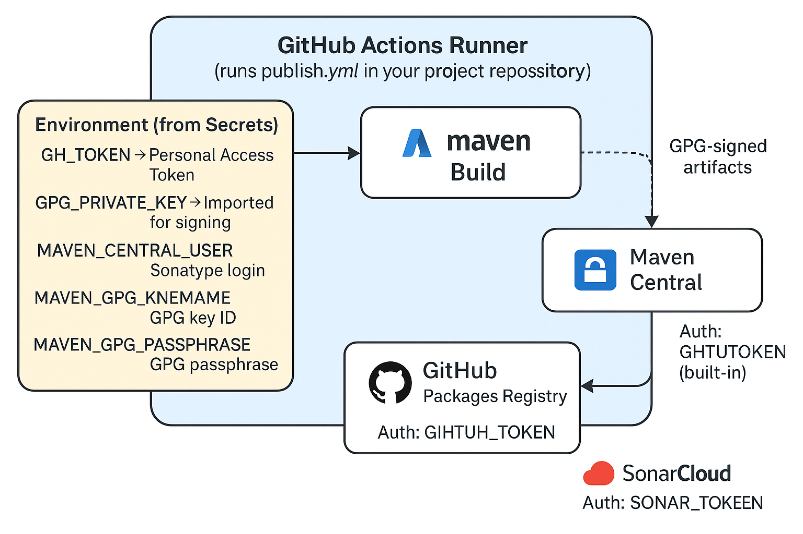

# exception-retry

A sample code to explore resilience-4j and rxJava3

## How to build and upload to central.sonatype.org
1. You can just use ```mvn clean test``` (without passphrase) for local testing
2. After you have git add the source files and git commit done then use scripts/release.sh
# ⚡ Exception-Retry — Functional Resilience for Java

> **Elegant, composable error handling and retries** powered by [Resilience4j](https://resilience4j.readme.io/), [Vavr](https://www.vavr.io/), and Lombok’s [`@ExtensionMethod`](https://projectlombok.org/features/experimental/ExtensionMethod).

[](https://github.com/venkateshamurthy/exception-retry/actions)
[](https://central.sonatype.com/artifact/io.github.venkateshamurthy/exception-retry)
[](https://javadoc.io/doc/io.github.venkateshamurthy/exception-retry)
[](LICENSE)
[](https://openjdk.org/)
[](https://sonarcloud.io/summary/new_code?id=io.github.venkateshamurthy%3Aexception-retry)
[](https://sonarcloud.io/summary/new_code?id=io.github.venkateshamurthy%3Aexception-retry)
[](https://sonarcloud.io/summary/new_code?id=io.github.venkateshamurthy%3Aexception-retry)
---

## 🌱 Overview

`exception-retry` transforms Java’s traditional exception handling into **declarative, functional pipelines**.

It integrates:
- ✅ **Resilience4j** for retries, circuit breakers, bulkheads, and rate limiters
- ✅ **Vavr** for `Try` and `Either` semantics
- ✅ **Lombok @ExtensionMethod** for *natural*, OO-style fluent APIs

Instead of procedural `try/catch` spaghetti, write **intention-revealing resilience** like this:

```java
function
  .errorMappedFunction(...)
  .retryFunction(retry)
  .tryWrap()
  .toEither();
```
### Features
| Category	              | Description                                                   |
|------------------------|---------------------------------------------------------------|
| Retry	                 |Declarative .retryFunction(), .retrySupplier(), .retryBiFunction()|
| Error Mapping	         |Transform exceptions via .errorMappedFunction()                |
| Error Consumption	     |React to exceptions without throwing via .errorConsumedFunction() |
| Circuit Breaker	       |.circuitBreakFunction(cb) and .circuitBreakCheckedFunction(cb) |
| Bulkhead	              |.bulkheadFunction(bh) and .bulkheadBiFunction(bh)              |
| Try / Either Integration |Safe wrapping via .tryWrap() and .toEither()                  |
| Checked Exceptions	    |Seamless handling of IOException, SQLException, etc.           |
| Composable	            |Every transformation returns a function — pure and chainable   |
 | CommonRuntimeException and ExceptionCode| Make it easier to construct error             |

### Installation
Add the following to your Maven pom.xml:
```xml
<dependency>
    <groupId>io.github.venkateshamurthy</groupId>
    <artifactId>exception-retry</artifactId>
    <version>1.5</version> <!-- replace with latest -->
</dependency>
```
### Quick Start
Enable Lombok's Extension Methods such as follows (in case if you are willing tomake sue of Lombok's experimental feature)
```java
import lombok.experimental.ExtensionMethod;
import io.github.venkateshamurthy.exceptional.*;

@ExtensionMethod({RxFunction.class,RxSupplier.class,RxTry.class})
public class MyService { }
```
You can call now as

|With Extension Method                | Without Extension Method                        |
|-------------------------------------|-----------------------------------------------  |
|function.retryFunction(retry);       | RxFunction.retryFunction(function, retry);      |
|supplier.errorConsumedSupplier(...) |RxSupplier.errorConsumedSupplier(supplier,...)   |
|checkedFn.retryCheckedFunction(...) |RxFunction.retryCheckedFunction(checkedFn,retry);|

### Delay and RetryConfig use
```java
import io.github.resilience4j.retry.Retry;
import io.github.resilience4j.retry.RetryConfig;
import static io.github.venkateshamurthy.exceptional.Delayer.FIBONACCI;

Retry retry = Retry.of("example", RetryConfig.custom()
    .intervalFunction(FIBONACCI.millis(1, 300))
    .retryExceptions(IOException.class, SQLException.class)
    .maxAttempts(10)
    .build());
```
#### Available strategies:
* FIBONACCI — gentle growth
* EXPONENTIAL — aggressive recovery
* LINEAR — predictable retry rate
* LOGARITHMIC — slow ramp-up

### Core examples
#### Function example
```java
Function<String, Integer> fn = toFunction(s -> {
    if (s == null) throw new NullPointerException();
    if (s.equals("bad")) throw new UnsupportedOperationException();
    return s.length();
});

Either<Throwable, Integer> result = fn
    .errorMappedFunction(
         UnsupportedOperationException.class, IllegalStateException::new,
         NullPointerException.class, IllegalArgumentException::new
    )
    .retryFunction(retry)
    .tryWrap()
    .toEither()
    .apply("bad");
```
➡ *Readable, composable resilience* with minimal boilerplate.

#### Supplier example

```java
Supplier<Integer> s = toSupplier(() -> {
    String input = "hi";
    if (input.length() < 3) throw new IllegalStateException("too short");
    return input.length();
});

Supplier<Integer> safe = s
    .errorConsumedSupplier(IllegalStateException.class, ex -> log.warn("Handled: {}", ex.getMessage()))
    .retrySupplier(retry);

Try<Integer> t = safe.tryWrap();
Either<Throwable, Integer> e = t.toEither();
```
✅ Perfect for metrics or observability layers.

#### CheckedBiFunction Example

```java
CheckedBiFunction<String, String, Integer> f = toCheckedBiFunction((a, b) -> {
    if (a.equals(b)) throw new IOException("equal!");
    if (a.isEmpty()) throw new SQLException("empty");
    return (a + b).length();
});

CheckedBiFunction<String, String, Integer> resilient = f
    .errorConsumedCheckedBiFunction(SQLException.class, ex -> log.warn("SQL error"))
    .retryCheckedBiFunction(retry);

Either<Throwable, Integer> out = resilient.tryWrap("a", "b").toEither();
```
✅ Handles checked exceptions
✅ Applies retry semantics
✅ Returns Vavr Either

### Design Philosophy

1️⃣ Declarative Resilience

Resilience becomes expressive, not procedural:
```java
fn.errorMappedFunction(...)
  .retryFunction(retry)
  .tryWrap()
  .toEither();
```
No try-catch pollution — the chain reads like a narrative.

2️⃣ Checked Exceptions, Elevated

Java checked exceptions (IOException, SQLException) are supported directly in CheckedFunction and CheckedBiFunction.
3️⃣ Composability by Design

Each method returns a new transformed function, not a side-effecting wrapper.
This enables seamless chaining:
```java
fn.errorMappedFunction(...)
  .bulkheadFunction(bh)
  .circuitBreakFunction(cb)
  .retryFunction(retry)
  .tryWrap();
```
4️⃣ Observability-First

Because wrappers are built on Resilience4j, metrics like retry attempts, success/failure counts,
and circuit state are directly accessible.

5️⃣  Building Exception made easier

Often, we may find building exception in a context can be very mundane, tedious, repetitive and verbose leading
to most of the real estate in the coding occupied by exception building drudge. Most of the time the finite set of 
errors are codified to enums with a short description of the error and for web applications it is prudent to accompany
by with HTTPStatus. Here is an example following a logger style of convenience.
```java
CREDENTIAL_MISSING.toCommonRTE("CDN Access Creds are wrong",
        "Missing or invalid credential ID: {}", request.getCredentialId())
    .logInfo();
```
A variant to the above is to provide a key based marker in the message template such as
```java
CREDENTIAL_MISSING.toCommonRTE("CDN Access Creds are wrong",
        "Missing or invalid credential ID: {credId}", Map.of("credId", request.getCredentialId()))
    .logInfo();
```
The common runtime exception class offers override setters in fluent way to reset detail message or status etc 

### Advanced Patterns

#### Primary + Fallback

```java
var primarySafe = primarySupplier.retrySupplier(primaryRetry);
var fallbackSafe = fallbackSupplier.retrySupplier(fallbackRetry);

var result = primarySafe.tryWrap()
    .recoverWith(err -> fallbackSafe.tryWrap())
    .get();
```
#### Circuit Breaker, Retry
```java
var circuitSafe = fn
    .circuitBreakFunction(circuitBreaker)
    .retryFunction(retry)
    .tryWrap();
```
### Full example
```java
import lombok.experimental.ExtensionMethod;
import io.github.resilience4j.retry.Retry;
import io.github.resilience4j.retry.RetryConfig;
import io.github.resilience4j.core.functions.CheckedBiFunction;
import io.vavr.control.Either;
import static io.github.venkateshamurthy.exceptional.Delayer.FIBONACCI;

@ExtensionMethod({
  io.github.venkateshamurthy.exceptional.RxFunction.class,
  io.github.venkateshamurthy.exceptional.RxTry.class
})
public class FullExample {
  public static void main(String[] args) {
    Retry retry = Retry.of("demo", RetryConfig.custom()
        .intervalFunction(FIBONACCI.millis(10, 500))
        .maxAttempts(5)
        .retryExceptions(java.io.IOException.class)
        .build());

    CheckedBiFunction<String, String, Integer> f = toCheckedBiFunction((a, b) -> {
      if (a == null || b == null) throw new java.sql.SQLException("null");
      if (a.equals(b)) throw new java.io.IOException("io");
      return (a + b).length();
    });

    var resilient = f
      .errorConsumedCheckedBiFunction(java.sql.SQLException.class, ex -> System.out.println("SQL consumed"))
      .retryCheckedBiFunction(retry);

    Either<Throwable, Integer> out = resilient.tryWrap("hello", "world").toEither();
    out.peek(System.out::println).peekLeft(e -> e.printStackTrace());
  }
}
```

## 🏗️ CI/CD Architecture – Maven Central + GitHub Packages

The following diagram illustrates the complete **build, signing, and publishing flow**
for projects inheriting from `modern-java-parent`.  
It highlights how **GitHub Actions**, **Maven Central**, **GitHub Packages**, and **SonarCloud**
interact through securely managed secrets and tokens.

<p align="center">
  
</p>

**Diagram overview:**
- 🔹 **GitHub Actions Runner** executes the `publish.yml` workflow defined in each repository.
- 🔹 Environment secrets (e.g., `GH_TOKEN`, `MAVEN_CENTRAL_TOKEN`, `GPG_PRIVATE_KEY`) are injected securely at runtime.
- 🔹 **Maven** builds, tests, and signs all artifacts using your GPG key.
- 🔹 Signed artifacts are then:
    - Published to **Maven Central** (authenticated via `MAVEN_CENTRAL_USER` / `MAVEN_CENTRAL_TOKEN`)
    - Deployed to **GitHub Packages** (using your `GH_TOKEN` Personal Access Token)
- 🔹 **SonarCloud** analysis is optionally triggered using `SONAR_ORG` / `SONAR_TOKEN`.
- 🔹 **GitHub Pages** automatically hosts generated Javadocs via the built-in `GITHUB_TOKEN`.

> 🧠 *Each project maintains its own `publish.yml` workflow and secrets — ensuring isolated,
secure, and independently verifiable release automation.*

---

### 🔐 Token Reference Summary

| Token / Secret | Purpose | Provided By |
|----------------|----------|--------------|
| `GH_TOKEN` | Publish artifacts to GitHub Packages | Personal Access Token (repo secret) |
| `GPG_PRIVATE_KEY` | Sign artifacts before publishing | Exported GPG key (repo secret) |
| `MAVEN_CENTRAL_USER` / `MAVEN_CENTRAL_TOKEN` | Authenticate with Sonatype Central | Sonatype account |
| `MAVEN_GPG_KEYNAME` / `MAVEN_GPG_PASSPHRASE` | Identify and unlock GPG key | Your keypair |
| `SONAR_ORG` / `SONAR_TOKEN` | Enable SonarCloud analysis | SonarCloud |
| `GITHUB_TOKEN` | Publish docs or releases to this repo | Auto-provided by GitHub |

---

📘 *This CI/CD workflow ensures a clean, repeatable release pipeline for modern Java projects — combining artifact signing, dual registry publishing, and static analysis in one automated process.*

## 🧑 Author

**Venkatesha Murthy**

Collaborative technologist and creator of Exception-Retry, a library designed to unify 
resilience, readability, and functional purity in Java.

------------------------------------------
“Functional elegance meets production resilience.”
— Exception-Retry Design Philosophy